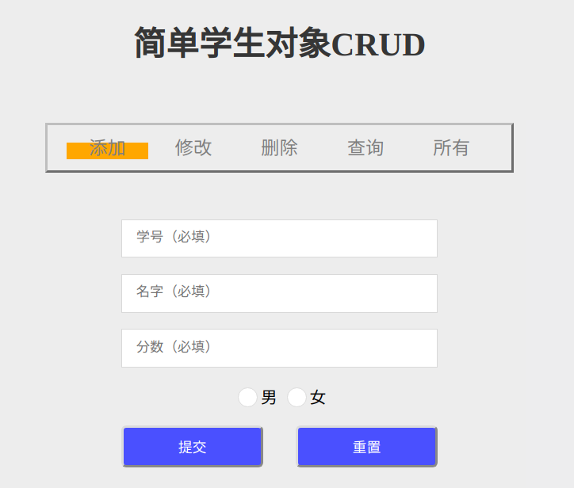
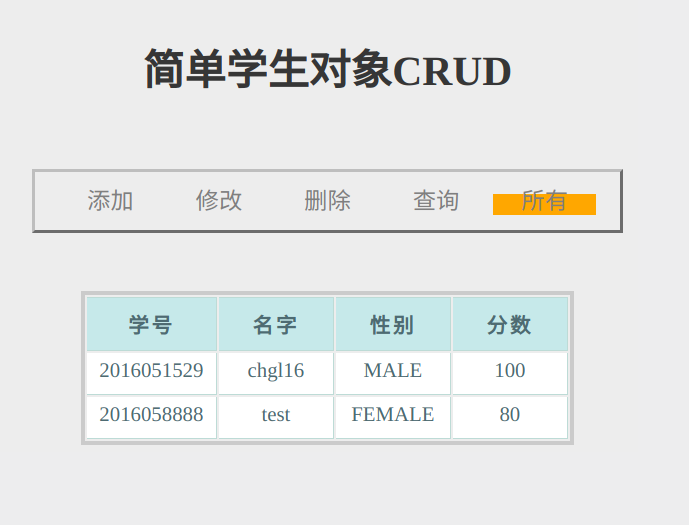

# Spring-data-redis开发实战

## 1. 开发环境


* 核心依赖
```xml
<dependency>
    <groupId>org.springframework.data</groupId>
    <artifactId>spring-data-redis</artifactId>
    <version>2.0.3.RELEASE</version>
</dependency>

<dependency>
    <groupId>redis.clients</groupId>
    <artifactId>jedis</artifactId>
    <version>2.9.0</version>
    <type>jar</type>
</dependency>
```
  
<br>

## 2. 部署运行
开启redis服务端，默认使用本地，端口也是使用默认的6379
>redis连接配置可以在config包下修改工厂bean  
但是新版本JedisConnectionFactory已经丢弃这些基本属性

```xml
# 生成war包
mvn clean package 
```

<br>

## 3. 效果预览
    视图功能并未完善，详情见index.jsp和StudentController.java
 


<br>

## 4. 核心实现
1. 配置注入redis相关bean, @EnableRedisRepositories必须注解，指向下面的dao层。
```java
@Configuration
@EnableRedisRepositories(basePackages = "xyz.cglzwz.dao")
public class RedisConfig {
    @Bean
    JedisConnectionFactory jedisConnectionFactory() {
        JedisConnectionFactory jedisConFactory
                = new JedisConnectionFactory();
        return jedisConFactory;
    }

    @Bean
    public RedisTemplate<String, Object> redisTemplate() {
        RedisTemplate<String, Object> template = new RedisTemplate<>();
        template.setConnectionFactory(jedisConnectionFactory());
        return template;
    }
}
```
2. 实体类使用@RedisHash("Student")注解，并实现序列化借口。实现redis对对象存储操作的基础。
```java
@RedisHash("Student")
public class Student implements Serializable {
    public enum Gender {
        MALE, FEMALE
    }

    private String id;
    private String name;
    private Gender gender;
    private Integer grade;

    /** getter and setter **/
}
```

3. dao直接基础Spring-data-redis包中一个已经实现了CRUD的简单Redis的Dao操作类即可
```java
@Repository
public interface StudentRepository extends CrudRepository<Student, String> { }
```

4. 业务实现, 简单的CRUD
```java
@Service
public class StudentServiceImpl implements StudentService {
    private final static Logger log = LoggerFactory.getLogger(StudentServiceImpl.class);

    @Autowired
    private StudentRepository studentRepository;

    @Override
    public void create(Student student) {
        studentRepository.save(student);
    }

    @Override
    public Student retrieve(String id) {
        return studentRepository.findById(id).get();
    }

    @Override
    public void update(Student student) {
        Student retrieveStudent = studentRepository.findById(student.getId()).get();
        if (student.getName() != null) {
            retrieveStudent.setName(student.getName());
        }
        if (student.getGrade() != null) {
            retrieveStudent.setGrade(student.getGrade());
        }
        studentRepository.save(retrieveStudent);
    }

    @Override
    public void delete(String id) {
        studentRepository.deleteById(id);
    }

    @Override
    public List<Student> findAll() {
        List<Student> students = new ArrayList<Student>();
        studentRepository.findAll().forEach(students::add);
        return students;
    }
}
```

<br>

## 5. 参考 & 总结
